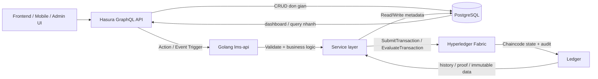
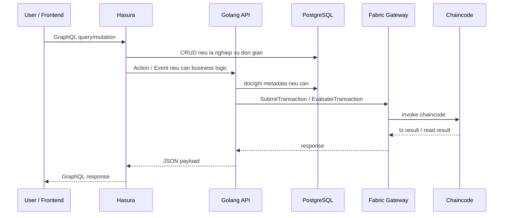
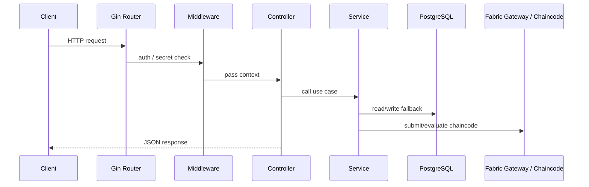
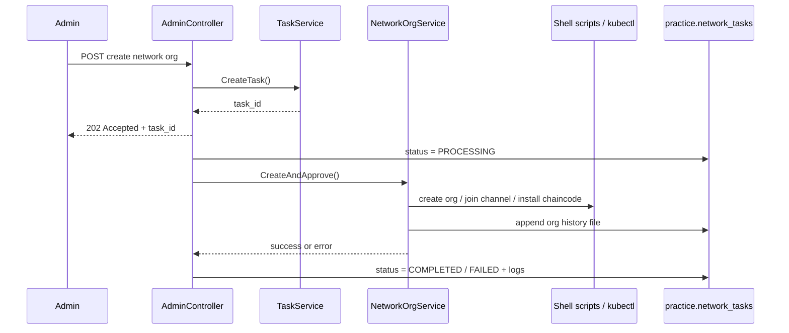

# API Flow - `lms-api`

Tai lieu nay mo ta luong van hanh thuc te cua backend `lms-api` trong repo hien tai.
No tap trung vao:

- Cac endpoint dang duoc register trong `routes/routes.go`
- Luong xu ly request: middleware -> controller -> service -> DB/Fabric/Hasura
- Co che fallback giua PostgreSQL va Hyperledger Fabric
- Luong async task trong `practice.network_tasks`
- Cac route noi bo cho Hasura action/event

## 0. So do tong the he thong



### 0.1 Luong chu dao



## 1. Tong quan kien truc

### 1.1 Entry point

Backend duoc khoi dong tu `smart-lms-fabric/backend/lms-api/main.go`:

1. Load config `app`, `database`, `fabric`, `hasura`
2. Ket noi PostgreSQL
3. Khoi tao cac service chinh:
   - `AuthService`
   - `StudentService`
   - `OrgService`
   - `CreditService`
   - `PermissionService`
   - `ExplorerService`
   - `HasuraActionService`
   - `NetworkOrgService`
   - `TaskService`
4. Inject service vao controller
5. Init JWT secret cho middleware
6. Dang ky route
7. Bật CORS va chay Gin server

### 1.2 Lop xu ly

Kien truc hien tai di theo flow:



### 1.3 Hai mau xu ly chinh

Backend dang dung 2 kieu luong:

1. **Read-first / chaincode-first**
   - Uu tien goi Fabric
   - Neu fail thi fallback sang PostgreSQL
   - Hay gap o cac API doc du lieu, liệt ke, tra cuu

2. **Write-first / DB-first**
   - Ghi PostgreSQL truoc
   - Thu day sang Fabric nhu mot buoc best-effort
   - Neu Fabric fail, van tra success neu DB da luu

### 1.4 Auth & bao mat

He thong co 3 luong auth rieng biet:

1. `Frontend -> Hasura`
   - Frontend gui `Authorization: Bearer <JWT>` len Hasura.
   - Hasura verify JWT va tu map claims sang `x-hasura-*` session variables.

2. `Hasura -> Golang Action/Event`
   - Hasura khong gui JWT goc sang backend.
   - Hasura forward `session_variables` trong payload va bo sung secret header.
   - Golang dung `session_variables` de biet user/role/campus/org.

3. `Direct REST -> Golang`
   - Cac route REST test/backward compatibility van dung `AuthMiddleware()` hoac `OptionalAuthMiddleware()`.
   - Neu goi REST truc tiep, token JWT se duoc parse boi middleware cua Go.

Tinh trang cac nhom route:

- `GET /health`, `/swagger`, `/explorer/*`, `/hasura/*`, `/api/hasura/*` la public hoac secret-based.
- `POST /api/auth/*` la public.
- `AuthMiddleware()` bat buoc JWT cho:
  - `/api/organizations/*`
  - `/api/student/*`
- `OptionalAuthMiddleware()` cho:
  - `/api/admin/*`
  - Neu co token thi context se co `user_id`, `student_id`, `public_key`, `role`.
  - Neu khong co token, request van di tiep.
- `RoleGuard()` co ton tai nhung chua duoc gan vao route nao trong code hien tai.

## 2. Route map tong quat

### 2.1 Public va he thong

| Route | Auth | Muc dich |
| --- | --- | --- |
| `GET /health` | Khong | Kiem tra service song |
| `GET /swagger` | Khong | Redirect toi Swagger UI |
| `GET /swagger/*any` | Khong | Serve Swagger UI / docs |

### 2.2 Auth

| Route | Auth | Muc dich |
| --- | --- | --- |
| `POST /api/auth/register` | Khong | Dang ky sinh vien va tao identity tren Fabric |
| `POST /api/auth/login` | Khong | Dang nhap va tra JWT |

### 2.3 Hasura callbacks

| Route | Auth | Muc dich |
| --- | --- | --- |
| `POST /hasura/actions` | Secret | Hasura action callback |
| `POST /hasura/actions/:actionName` | Secret | Hasura action callback co fallback action name |
| `POST /hasura/actions/debug-echo` | Secret | Debug echo cho Hasura payload |
| `POST /hasura/events/create-user-profile` | Secret | Hasura event tao `user_profiles` |
| `POST /api/hasura/actions` | Secret | Alias cua `/hasura/actions` |
| `POST /api/hasura/actions/:actionName` | Secret | Alias cua `/hasura/actions/:actionName` |
| `POST /api/hasura/actions/debug-echo` | Secret | Alias debug |
| `POST /api/hasura/events/create-user-profile` | Secret | Alias event |

### 2.4 Explorer public

| Route | Auth | Muc dich |
| --- | --- | --- |
| `GET /explorer/stats` | Khong | So lieu tong quan network |
| `GET /explorer/org/:publicKey` | Khong | Tra cuu organization |
| `GET /explorer/user/:publicKey` | Khong | Tra cuu student/user |
| `GET /explorer/wallet/:walletId` | Khong | Tra cuu wallet |
| `GET /explorer/tx/:txId` | Khong | Tra cuu transaction |
| `GET /explorer/search?query=...` | Khong | Global search |
| `GET /explorer/history/:userId` | Khong | Lich su theo user/org |

### 2.5 Admin

| Route | Auth | Muc dich |
| --- | --- | --- |
| `POST /api/admin/org-requests` | JWT optional | Tao request student -> org |
| `GET /api/admin/network` | JWT optional | Tong quan Fabric network |
| `GET /api/admin/network/organizations` | JWT optional | Danh sach org trong network |
| `GET /api/admin/network/organizations/history` | JWT optional | Lich su org |
| `GET /api/admin/network/chaincodes/history` | JWT optional | Lich su deploy chaincode |
| `POST /api/admin/network-organizations` | JWT optional | Tao org moi theo async task |
| `GET /api/admin/network-organizations/tasks/:taskId` | JWT optional | Poll task status/log |
| `POST /api/admin/network/init` | JWT optional | Init lai toan bo network |
| `POST /api/admin/org-requests/:relationId/review` | JWT optional | Duyet/tuchoi request |
| `POST /api/admin/permissions` | JWT optional | Cap quyen |
| `POST /api/admin/credits` | JWT optional | Issue credit |
| `GET /api/admin/tx/:txId` | JWT optional | Tra ve tx id (placeholder) |
| `GET /api/admin/history/:refType/:refId` | JWT optional | Tra cuu history chaincode |

### 2.6 Organization

| Route | Auth | Muc dich |
| --- | --- | --- |
| `GET /api/organizations/:orgId/credits` | JWT bat buoc | Lay credit cua org |
| `GET /api/organizations/:orgId/students` | JWT bat buoc | Lay student cua org |
| `POST /api/organizations/:orgId/credits` | JWT bat buoc | Issue credit tu org |
| `POST /api/organizations/:orgId/students` | JWT bat buoc | Request student vao org |

### 2.7 Student

| Route | Auth | Muc dich |
| --- | --- | --- |
| `GET /api/student/profile` | JWT bat buoc | Lay profile |
| `PUT /api/student/profile` | JWT bat buoc | Update profile |
| `GET /api/student/profile/history` | JWT bat buoc | History update profile |
| `GET /api/student/orgs` | JWT bat buoc | Lay danh sach org |
| `POST /api/student/org-requests/:relationId/review` | JWT bat buoc | Student review request |
| `GET /api/student/credits` | JWT bat buoc | Lay credits cua student |
| `GET /api/student/history` | JWT bat buoc | Tong hop history |
| `GET /api/student/history/orgs` | JWT bat buoc | History org requests |
| `GET /api/student/history/credits` | JWT bat buoc | History credits |
| `GET /api/student/history/profile` | JWT bat buoc | History profile |
| `GET /api/student/tx/:txId` | JWT bat buoc | Tra ve tx id (placeholder) |

### 2.8 Route V2

`/api/v2/admin/*` hien dang bi comment trong `routes/routes.go`, nen **chua duoc expose**.
Code van ton tai trong `controllers/admin_v2_controller.go`, nhung khong phai surface API active.

## 3. Luong khoi dong he thong

### 3.1 Config duoc load

`config/app.go`, `config/database.go`, `config/fabric.go`, `config/hasura.go` cung cap cac env quan trong:

- `APP_PORT`
- `JWT_SECRET`
- `ALLOWED_ORIGINS`
- `DATABASE_DSN` hoac `DB_HOST`, `DB_PORT`, `DB_USER`, `DB_PASSWORD`, `DB_NAME`
- `FABRIC_MSP_ID`
- `FABRIC_CHANNEL`
- `FABRIC_CHAINCODE`
- `FABRIC_PEER`
- `FABRIC_CONNECTION_PROFILE`
- `FABRIC_WALLET`
- `HASURA_ADMIN_SECRET`

### 3.2 Fabric gateway

`services/fabric_service.go` la lop trung gian goi chaincode:

1. Load wallet identity tu file YAML
2. Load connection profile YAML
3. Tim peer theo `FABRIC_PEER`
4. Tao TLS gRPC connection
5. Tao X509 identity + signer
6. Mo Gateway
7. Chon `channel` va `chaincode`
8. `SubmitTransaction` cho write
9. `EvaluateTransaction` cho read

Do do, tat ca API lam viec voi Fabric deu di qua 1 nhu cau chung:

- `submitJSON(...)` -> write
- `evalJSON(...)` -> read 1 object
- `evalJSONArray(...)` -> read array

## 4. Auth flow

### 4.1 `POST /api/auth/register`

Payload:

```json
{
  "username": "nguyenvana",
  "password": "mypassword123",
  "full_name": "Nguyen Van A",
  "cccd": "123456789012"
}
```

Luong xu ly:

1. `AuthController.Register` bind JSON vao `services.RegisterRequest`
2. `AuthService.Register`
3. Check duplicate `username` trong `public.users.metadata->>'username'`
4. Hash `password`
5. Hash `cccd`
6. Sinh `student_id`
7. Goi Fabric `CreateStudent`
8. Lay `public_key` tu response chaincode
9. Tao row `public.users`
10. Tao row `cms.blockchain_identities`
11. Tra ve thong tin user da tao

Diem can chu y:

- Register **khong tra JWT**
- Fabric la buoc bat buoc; neu Fabric fail thi register fail

### 4.2 `POST /api/auth/login`

Payload:

```json
{
  "username": "nguyenvana",
  "password": "mypassword123"
}
```

Luong xu ly:

1. Tim user theo `metadata->>'username'`
2. Parse `user.Metadata`
3. Neu `student_id` chua co, backend se sinh va cap nhat lai metadata
4. Check password hash
5. Neu `public_key` chua co, backend goi Fabric de bo sung
6. Tao JWT voi:
   - `user_id`
   - `username`
   - `student_id`
   - `public_key`
   - `role`
7. Neu role la `manager`, token role se duoc map thanh `organization`
8. Tra ve token + profile

JWT claim do middleware doc lai o cac route can auth.

## 5. Hasura callbacks

`routes/hasura_callbacks.go` dang ky cung 2 prefix:

- `/hasura`
- `/api/hasura`

### 5.1 Co che secret

`controllers.HasuraAction(...)` va `DebugEcho` se check secret header thong qua:

- `x-hasura-admin-secret`
- `x-api-key`
- `x-hasura-webhook-secret`

Neu khong co secret nao duoc cau hinh, callback se cho qua.

### 5.2 Luong action

1. `HasuraAction` middleware verify secret
2. Bind JSON payload
3. Neu `payload.action.name` trong, lay fallback tu URL `:actionName`
4. Dat payload vao context
5. `HasuraActionController.Handle` nhan payload
6. Neu can, controller se check them `adminSecret`
7. `HasuraActionService.Handle` dispatch theo action name

### 5.3 Input format duoc chap nhan

Backend chap nhan 3 kieu payload:

```json
{
  "input": {
    "student_id": "STU001"
  }
}
```

hoac:

```json
{
  "object": {
    "student_id": "STU001"
  }
}
```

hoac:

```json
{
  "args": {
    "student_id": "STU001"
  }
}
```

Backend cung chap nhan payload raw neu khong co wrapper.

### 5.4 Bieu do action

| Nhom action | Alias | Service |
| --- | --- | --- |
| Auth | `create_user`, `createUser` | `AuthService.CreateUser` |
| Auth | `register`, `register_student` | `AuthService.Register` |
| Auth | `login` | `AuthService.Login` |
| Credit | `issue_credit`, `create_credit`, `create_student_credit` | `CreditService.IssueCredit` |
| Org request | `request_student_to_org`, `create_org_request` | `OrgService.RequestStudentToOrg` |
| Org request | `send_student_approval_request`, `school_send_student_request`, `request_student_approval` | `OrgService.RequestStudentToOrg` |
| Review org | `review_org_request` | `OrgService.ReviewStudentOrganizationRequest` |
| Review org | `approve_student_request`, `approve_org_request`, `student_approve_request` | `OrgService.ReviewStudentOrganizationRequest` |
| Review org | `reject_student_request`, `reject_org_request`, `student_reject_request` | `OrgService.ReviewStudentOrganizationRequest` |
| Student info | `get_student_info`, `get_student_detail`, `view_student_info`, `student_detail` | `StudentService.GetStudent` / `GetStudentByPublicKey` |
| Permission | `request_access_permission`, `send_access_permission_request`, `request_permission` | `PermissionService.RequestAccessPermission` |
| Permission review | `approve_access_permission`, `approve_permission` | `PermissionService.ApproveAccessPermission` |
| Permission review | `reject_access_permission`, `reject_permission` | `PermissionService.RejectAccessPermission` |
| Direct grant | `grant_access`, `grant_permission` | `PermissionService.GrantAccess` |
| Direct revoke | `revoke_access`, `revoke_permission` | `PermissionService.RevokeAccess` |

### 5.5 Debug va event

- `POST /hasura/actions/debug-echo`
  - Tra ve `message`, `userId`, `role`
  - Dung de debug secret/session variables
- `POST /hasura/events/create-user-profile`
  - Lay `user` moi tao tu event payload
  - Kiem tra da co `user_profiles` chua
  - Neu chua co, tao record moi qua Hasura GraphQL
  - Metadata duoc map sang `display_name`, `locale`, `avatar_url`

## 6. Explorer flow

Explorer la nhom API public, khong can JWT.

### 6.1 `GET /explorer/stats`

Nguon du lieu:

- PostgreSQL only

Dem:

- `cms.organizations`
- `public.users` voi `role = student`
- `cms.credit_records`
- `cms.transaction_index`
- `cms.blockchain_identities`

### 6.2 `GET /explorer/org/:publicKey`

Thu tu:

1. Goi Fabric `GetOrganization(publicKey)`
2. Neu fail, fallback sang PostgreSQL `cms.organizations`
3. Dem so student active va so credit cua org

### 6.3 `GET /explorer/user/:publicKey`

Thu tu:

1. Tim trong PostgreSQL theo `public_key`
2. Neu khong co, goi Fabric `GetStudentByPublicKey`
3. Neu co ket qua Fabric ma DB chua co, tra ve response tu chaincode
4. Neu DB co, enrich them:
   - `org_count`
   - `total_credits`
   - `course_count`
   - `wallet_ref`
   - `msp_id`

### 6.4 `GET /explorer/wallet/:walletId`

Thu tu:

1. Goi Fabric `GetStudentPrivateWallet`
2. Neu khong co, goi Fabric `GetOrganizationPrivateWallet`
3. Neu van khong co, fallback sang `cms.blockchain_identities`

### 6.5 `GET /explorer/tx/:txId`

Thu tu:

1. Goi Fabric `GetTransactionIndex`
2. Neu fail, fallback sang `cms.transaction_index`

### 6.6 `GET /explorer/search?query=...`

Search se lan luot thu:

1. Organization
2. Student/user
3. Transaction
4. Wallet

Neu khong co ket qua nao, API tra ve `unknown`.

### 6.7 `GET /explorer/history/:userId`

History se merge:

- Chaincode history cho student
- Chaincode history cho organization
- DB fallback tu `cms.transaction_index`

## 7. Admin flow

Admin route group dung `OptionalAuthMiddleware()`.
No khong bat JWT, nhung neu co JWT thi context se co claim de phuc vu audit/log.

### 7.1 `POST /api/admin/org-requests`

Flow:

1. Bind `student_id`, `org_id`, `role`
2. Gọi `OrgService.RequestStudentToOrg`
3. Tao request tren Fabric

API nay ve ban chat la wrapper cho request student -> org.

### 7.2 `GET /api/admin/network`

`NetworkOrgService.GetOverview()` gom:

- `kubectl get fabricmainchannels`
- `kubectl get deployments`
- `ListOrganizations()`
- `GetChaincodeHistory()` tu `history.json`
- `GetOrgHistory()` tu `historyOrg.json`

Ket qua la mot snapshot tong the cua network.

### 7.3 `GET /api/admin/network/organizations`

Nguon:

- `kubectl get fabriccas`
- `kubectl get fabricpeers`
- `kubectl get fabricfollowerchannels`

Backend ghep cac resource nay thanh danh sach org:

- `CA`
- `Peer`
- `Channel`
- `MSP ID`

### 7.4 `GET /api/admin/network/organizations/history`

Doc `historyOrg.json`, sap xep theo `createdAt`.

### 7.5 `GET /api/admin/network/chaincodes/history`

Doc `history.json`, sap xep theo:

1. chaincode
2. channel
3. sequence

### 7.6 `POST /api/admin/network-organizations`

Day la flow async quan trong nhat cua admin:



Luong xu ly thuc te:

1. Tao row `practice.network_tasks` voi status `PENDING`
2. Tra ve ngay `202 Accepted`
3. Chay goroutine background
4. Update `PROCESSING`
5. Goi `NetworkOrgService.CreateAndApprove`
6. Neu fail:
   - set `FAILED`
   - ghi log loi
7. Neu thanh cong:
   - set `COMPLETED`

`CreateAndApprove` se:

- validate `org_code`
- check scripts co ton tai
- doc `history.json` de lay chaincode latest
- chay `06-create-org.sh`
- chay `12-join-org-to-channel.sh`
- chay `15-install-existing-chaincode-for-org.sh`
- append `historyOrg.json`
- neu `upgrade_policy = true`:
  - build endorsement policy
  - chay approve/commit cho cac org can tham gia

### 7.7 `GET /api/admin/network-organizations/tasks/:taskId`

Doc row `practice.network_tasks` va tra ve:

- `task_id`
- `status`
- `logs`
- `created_at`
- `updated_at`

### 7.8 `POST /api/admin/network/init`

Flow:

1. Tao task trong `practice.network_tasks`
2. Background goroutine chay `RunInitNetworkScriptWithLogging`
3. Log stream duoc gom lai va ghi vao `logs`
4. Status duoc cap nhat `PROCESSING -> COMPLETED/FAILED`

`RunInitNetworkScriptWithLogging` thuc chat goi `run-all.sh` va stream stdout/stderr line by line.

### 7.9 `POST /api/admin/org-requests/:relationId/review`

Flow:

1. Bind `decision`
2. Goi `OrgService.ReviewStudentOrganizationRequest`
3. Update status request tren Fabric

### 7.10 `POST /api/admin/permissions`

Flow:

1. Bind `GrantAccessRequest`
2. Goi `PermissionService.GrantAccess`
3. Tao permission tren Fabric

### 7.11 `POST /api/admin/credits`

Flow:

1. Bind `IssueCreditRequest`
2. Goi `CreditService.IssueCredit`
3. Tiep tuc submit len Fabric

### 7.12 `GET /api/admin/tx/:txId`

Hien tai la placeholder:

- Tra ve `tx_id` va `status = SUCCESS`
- Khong lookup thuc su

### 7.13 `GET /api/admin/history/:refType/:refId`

Thu tu:

1. Goi Fabric `GetHistoryByRef(refType, refId)`
2. Tra ve danh sach transactions

## 8. Organization flow

### 8.1 `GET /api/organizations/:orgId/credits`

Thu tu:

1. Goi chaincode `GetCreditsByOrg(orgId)`
2. Neu co du lieu, tra ve ngay
3. Neu fail, fallback sang PostgreSQL `cms.credit_records`

### 8.2 `GET /api/organizations/:orgId/students`

Thu tu:

1. Goi chaincode `GetOrganizationStudents(orgId)`
2. Neu co du lieu, enrich them bang:
   - `public.users`
   - `cms.blockchain_identities`
   - `StudentService.GetStudent(...)`
3. Neu fail, fallback sang PostgreSQL `cms.student_organizations`

### 8.3 `POST /api/organizations/:orgId/credits`

Day la write-first flow:

1. Lookup user theo `metadata->>'student_id'`
2. Tao `cms.credit_records`
3. Thu push sang Fabric `IssueCredit`
4. Neu Fabric fail, van tra success voi message:
   - `Credit saved to PostgreSQL (chaincode unavailable)`

### 8.4 `POST /api/organizations/:orgId/students`

Day la write-first flow:

1. Input body:
   - `public_key`
   - `role` (neu bo trong, default `STUDENT`)
2. Lookup user theo `public_key`
3. Parse metadata de lay `student_id`
4. Tao `relation_id`
5. Tao row `cms.student_organizations` voi status `PENDING`
6. Thu push sang Fabric `RequestStudentToOrg`
7. Neu Fabric fail, van tra success voi data DB

### 8.5 Note

`OrganizationController.RequestPermission()` co ton tai trong code, nhung:

- return `501 Not Implemented`
- khong duoc register vao route

## 9. Student flow

Student route group bat buoc JWT.
`middleware.GetUserIDFromContext()` va `middleware.GetStudentIDFromContext()` la 2 gia tri duoc su dung nhieu nhat.

### 9.1 `GET /api/student/profile`

Nguon:

- PostgreSQL only

Backend doc `public.users`, `cms.blockchain_identities`, va dem:

- so org active
- tong credit

### 9.2 `PUT /api/student/profile`

Luong:

1. Bind `full_name` va/hoac `email`
2. Update `public.users`
3. Thu goi Fabric `UpdateStudent` neu co `full_name`
4. Tao row `cms.transaction_index` voi action `UPDATE_PROFILE`

Neu Fabric update fail, request van thanh cong neu PostgreSQL update da xong.

### 9.3 `GET /api/student/profile/history`

Merge:

- `cms.transaction_index` voi action `UPDATE_PROFILE`
- chaincode history `GetStudentHistory`

### 9.4 `GET /api/student/orgs`

Thu tu:

1. Goi Fabric `GetStudentOrganizations(studentID)`
2. Neu co du lieu, tra ve ngay
3. Neu fail, fallback sang `cms.student_organizations`

### 9.5 `POST /api/student/org-requests/:relationId/review`

Luon kiem tra:

- `user_id` trong JWT
- `student_id` trong JWT

Flow:

1. Bind `relation_id` + `decision`
2. Update `cms.student_organizations.status`
3. Goi Fabric `ReviewStudentOrganizationRequest`
4. Neu Fabric fail, van tra success voi message fallback DB

### 9.6 `GET /api/student/credits`

Thu tu:

1. Lay `page` va `limit`
2. Goi Fabric `GetCreditsByStudent(studentID)`
3. Neu co du lieu, paginate trong memory
4. Neu fail, fallback sang `cms.credit_records`

### 9.7 `GET /api/student/history`

Day la endpoint tong hop nhieu nguon:

1. Chaincode student history
2. DB `cms.student_organizations`
3. DB `cms.credit_records`
4. DB `cms.transaction_index`
5. Sort giam dan theo `created_at`

### 9.8 `GET /api/student/history/orgs`

Nguon:

- `cms.student_organizations`

### 9.9 `GET /api/student/history/credits`

Nguon:

- `cms.credit_records`

### 9.10 `GET /api/student/history/profile`

Nguon:

- `cms.transaction_index`
- chaincode `GetStudentHistory`

### 9.11 `GET /api/student/tx/:txId`

Hien tai la placeholder:

- Tra ve `tx_id`
- Khong lookup thuc su

## 10. Task flow va `practice.network_tasks`

Migration `02-migrate-network-to-practice.sql` tao bang:

```sql
CREATE TABLE IF NOT EXISTS practice.network_tasks (
    task_id text PRIMARY KEY,
    status text,
    logs text,
    created_at timestamp with time zone DEFAULT NOW(),
    updated_at timestamp with time zone
);
```

### 10.1 Task status

`models.TaskStatus` co 4 trang thai:

- `PENDING`
- `PROCESSING`
- `COMPLETED`
- `FAILED`

### 10.2 Task lifecycle

1. Controller tao task moi qua `TaskService.CreateTask`
2. Tra ve `task_id`
3. Background worker cap nhat status
4. Logs duoc ghi vao cột `logs`
5. Client poll `GET /api/admin/network-organizations/tasks/:taskId`

### 10.3 Luong log

- `CreateNetworkOrganization`:
  - dung `UpdateTaskStatus`
  - khi fail thi ghi them `ERROR: ...`
- `InitNetwork`:
  - gom logs vao `strings.Builder`
  - update log dinh ky moi 500ms

### 10.4 Note

`TaskService.UpdateTaskLog()` dung raw SQL:

```sql
UPDATE practice.network_tasks SET logs = ? WHERE task_id = ?
```

Nghia la controller phai tu build chuoi log day du truoc khi ghi lai.

## 11. Data persistence map

| Bang | Vai tro | API hay dung |
| --- | --- | --- |
| `public.users` | Tai khoan dang nhap, metadata, role, public key | Auth, student profile, explorer |
| `cms.blockchain_identities` | Map user <-> wallet/public key/cert | Auth, explorer, organization enrich |
| `cms.organizations` | Thong tin organization | Explorer, organization fallback |
| `cms.student_organizations` | Request/join relation student-org | Organization, student history |
| `cms.credit_records` | Credit da cap | Organization, student, explorer |
| `cms.access_permissions` | Permission request/grant | Permission service |
| `cms.transaction_index` | Index tx cho tra cuu nhanh | Student history, explorer |
| `practice.network_tasks` | Async task cho network init/onboard | Admin network |
| `practice.campus` | Organization onboarding data | Phan backend nay co migration, chua phai API chinh trong file nay |
| `practice.organization_onboarding_documents` | Ho so onboarding | Same as tren |

## 12. Ket luan thuc thi

Neu nhin theo hanh vi thuc te, backend nay co 3 pattern rat ro:

1. **Auth + identity bootstrap**
   - Tao user tren Fabric va PostgreSQL
   - Token JWT dung cho cac route can quyen

2. **Business API hybrid**
   - Read thi co the chaincode-first
   - Write thi nhieu endpoint se DB-first roi moi push sang chaincode

3. **Network admin async**
   - Tat ca task nang ve Fabric network deu chay background
   - Trang thai va log duoc luu vao `practice.network_tasks`

## 13. Nguon code chinh can doc them

- `smart-lms-fabric/backend/lms-api/main.go`
- `smart-lms-fabric/backend/lms-api/routes/routes.go`
- `smart-lms-fabric/backend/lms-api/routes/hasura_callbacks.go`
- `smart-lms-fabric/backend/lms-api/controllers/auth_controller.go`
- `smart-lms-fabric/backend/lms-api/controllers/hasura_action_controller.go`
- `smart-lms-fabric/backend/lms-api/controllers/admin_controller.go`
- `smart-lms-fabric/backend/lms-api/controllers/organization_controller.go`
- `smart-lms-fabric/backend/lms-api/controllers/student_controller.go`
- `smart-lms-fabric/backend/lms-api/controllers/explorer_controller.go`
- `smart-lms-fabric/backend/lms-api/services/auth_service.go`
- `smart-lms-fabric/backend/lms-api/services/hasura_action_service.go`
- `smart-lms-fabric/backend/lms-api/services/explorer_service.go`
- `smart-lms-fabric/backend/lms-api/services/org_service.go`
- `smart-lms-fabric/backend/lms-api/services/credit_service.go`
- `smart-lms-fabric/backend/lms-api/services/permission_service.go`
- `smart-lms-fabric/backend/lms-api/services/task_service.go`
- `smart-lms-fabric/backend/lms-api/services/network_org_service.go`
- `smart-lms-fabric/backend/lms-api/services/network/init_service.go`
- `smart-lms-fabric/backend/lms-api/services/network/orderer_service.go`
- `smart-lms-fabric/backend/lms-api/services/network/org_service.go`
- `smart-lms-fabric/backend/lms-api/services/network/chaincode_service.go`
- `smart-lms-fabric/backend/lms-api/services/fabric_service.go`
